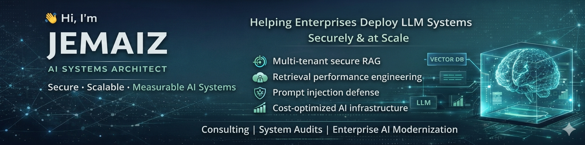

  

  

# 👋 Hi, I'm JEMAI.Z

## AI Systems Architect | Mentor & AI Project Evaluator
### Auditing & Architecting Secure, Scalable & ROI-Driven LLM Infrastructures

I don't just "implement" AI. I architect production-grade, multi-tenant AI systems that integrate Large Language Models into enterprise environments — with a relentless focus on **retrieval quality**, **security**, and **cost-to-serve optimization (FinOps IA)**.

---

## 👨‍🏫 My Dual Value Proposition

### 🔹 Architectural Leadership (For CTOs)
I take responsibility for the entire system lifecycle — not just model API usage. 
- Structuring robust RAG pipelines that survive real-world data drift.
- Designing prompt injection defenses into the architecture core.
- Optimizing infrastructure for a **40%+ reduction in API spend**.

### 🔹 Expert Vetting & Mentor (For Teams)
As an AI Project Evaluator and Mentor, I have audited [X] enterprise architectures, helping teams:
- Avoid classic pitfalls in RAG scaling and embedding model selection.
- Build benchmark-driven evaluation frameworks from day one.
- **Source & Vet top specialized talent** from my curated network of experts.

---

## 🏗 What I Architect (And the ROI)

🔹 **Enterprise Multi-Tenant RAG Platforms** with strict tenant data isolation **(99.9% isolation guarantee)**.
🔹 **Hybrid Search Infrastructures** (Sparse + Dense + Reranking) for **>95% retrieval accuracy**.
🔹 **Evaluation & Benchmarking Frameworks** to detect recall regression before it affects users.
🔹 **Cost-Optimized Inference Pipelines** with semantic caching and SLMs **(average 30% FinOps savings)**.

My work bridges **AI models**, **backend systems**, **security**, and **performance engineering**.

---

## 🎯 Core Capabilities (Production-Ready)

### Advanced Retrieval Systems
- Hybrid search (BM25 + vector search) & Cross-encoder reranking pipelines
- Dynamic top-k retrieval & Context compression to optimize token budgets

### Secure AI Architecture
- Context sanitization pipelines & OWASP LLM risk mitigation
- Tenant isolation enforcement & RBAC + JWT authentication

### Infrastructure & Deployment
- FastAPI-based AI services with Dockerized multi-service architecture
- Observability (latency, P95, cost tracking) and Kubernetes-ready deployment

### Evaluation & Governance
- Regression detection for recall drift & Embedding benchmarking
- Cost-performance tradeoff analysis for model selection

---

## 🚀 Representative Systems (My Proofs)

### 🔹 Enterprise RAG Platform (Multi-Tenant)
A secure knowledge system featuring: **Strict data isolation**, **Recall evaluation**, **Injection-resistant prompting**, and **Scalability strategy**.

---

### 🔹 Retrieval Benchmark Framework
A modular evaluation suite comparing: Sparse vs Dense vs Hybrid retrieval, Reranking impact, Embedding model performance, and Latency/cost implications.

---

### 🔹 AI Security Lab
Simulation and mitigation of: **Prompt injection**, **Data exfiltration**, **Context leakage**, and **Access control bypass**.

---

## 📊 Industries & Use Cases

- **Legal & Compliance Retrieval** (High precision)
- **Enterprise Knowledge Copilots** (Scalability)
- **Regulated Environments** (Security-first)

---

## 🤝 Collaboration & Vetting

I am open to:
- **Architectural Audits & Strategy** (For established roadmaps)
- **Full System Architecture & Deployment** (Cadrage & Supervision)
- **Vetting & Sourcing Specialized Teams** (Matching your needs with my certified network)

---

## 📬 Contact & Deep Dive

If your organization is deploying LLM systems and needs an independent, expert eye on:

• Architectural clarity  
• Performance improvement  
• Secure production deployment  
• Cost control and scalability  

**Book an Architectural Deep Dive (15 min):** [https://calendly.com/jemai/demo-ia-esn-15min](https://calendly.com/jemai/demo-ia-esn-15min)

> AI is easy to demo.  
> Architecture is what makes it survive production.
