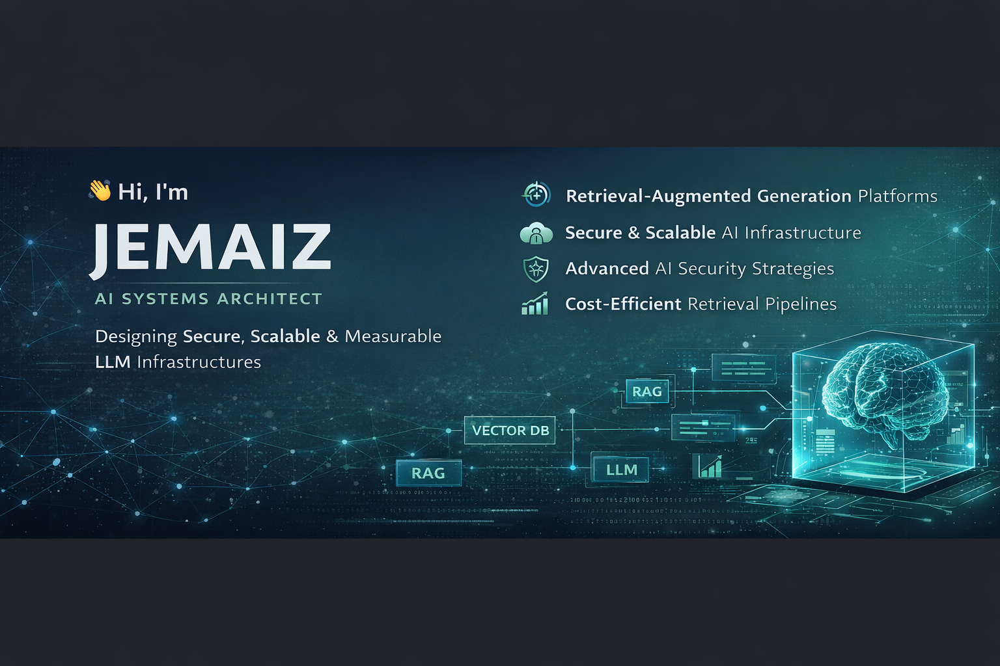

  

# 👋 Hi, I'm JEMAIZ

## AI Systems Architect  
### Designing Secure, Scalable & Measurable LLM Infrastructures

I architect production-grade AI systems that integrate Large Language Models into real business environments — with a strong focus on retrieval quality, system reliability, security, and cost efficiency.

I operate at the system level — not just model usage.

---

## 🏗 What I Architect

🔹 Enterprise Retrieval-Augmented Generation (RAG) systems  
🔹 Hybrid search infrastructures (Sparse + Dense + Reranking)  
🔹 Multi-tenant AI platforms  
🔹 Secure LLM applications (prompt injection resistant)  
🔹 Evaluation & benchmarking frameworks  
🔹 Cost-optimized inference pipelines  

My work bridges:
- AI models
- Backend systems
- Infrastructure
- Security
- Performance engineering

---

## 🎯 Architectural Principles

• Retrieval quality before model scaling  
• Benchmark before optimization  
• Security by design, not as a patch  
• Observability as a first-class citizen  
• Infrastructure defines AI reliability  

---

## 🔎 Core Capabilities

### Advanced Retrieval Systems
- Hybrid search (BM25 + vector search)
- Cross-encoder reranking pipelines
- Dynamic top-k retrieval
- Query rewriting & contextual expansion
- Context compression & token budget optimization

### Secure AI Architecture
- Prompt injection mitigation
- Context sanitization pipelines
- Tenant isolation enforcement
- RBAC + JWT authentication
- OWASP LLM risk mitigation strategies

### Infrastructure & Deployment
- FastAPI-based AI services
- Vector databases (Qdrant, Weaviate)
- Dockerized multi-service architecture
- Kubernetes-ready deployment
- CI/CD automation
- Observability (latency, P95, cost tracking)

### Evaluation & Governance
- Recall@k, MRR, nDCG measurement
- Embedding benchmarking
- A/B testing for retrieval pipelines
- Regression detection for recall drift
- Cost-performance tradeoff analysis

---

## 🚀 Representative Systems

### 🔹 Enterprise RAG Platform
A secure multi-tenant knowledge system including:
- Strict tenant data isolation
- Retrieval evaluation framework
- Injection-resistant prompting
- Cost monitoring & scaling strategy
- Production observability

---

### 🔹 Retrieval Benchmark Framework
A modular evaluation suite comparing:
- Sparse vs Dense vs Hybrid retrieval
- Reranking impact
- Embedding model performance
- Latency and cost implications

---

### 🔹 AI Security Lab
Simulation and mitigation of:
- Prompt injection
- Data exfiltration
- Context leakage
- Access control bypass

---

## 📊 Industries & Use Cases

- Enterprise knowledge copilots
- Legal and compliance retrieval systems
- HR and internal knowledge assistants
- Secure document intelligence platforms
- AI augmentation in regulated environments

---

## 🤝 Collaboration

Open to:
- AI system architecture consulting
- LLM infrastructure design
- Retrieval optimization missions
- Security hardening audits
- Enterprise AI modernization projects

---

## 📬 Contact

If your organization is deploying LLM systems and needs:

• Architectural clarity  
• Retrieval performance improvement  
• Secure production deployment  
• Cost control and scalability  

Let’s build systems that last beyond prototypes.

---

> AI is easy to demo.  
> Architecture is what makes it survive production.
